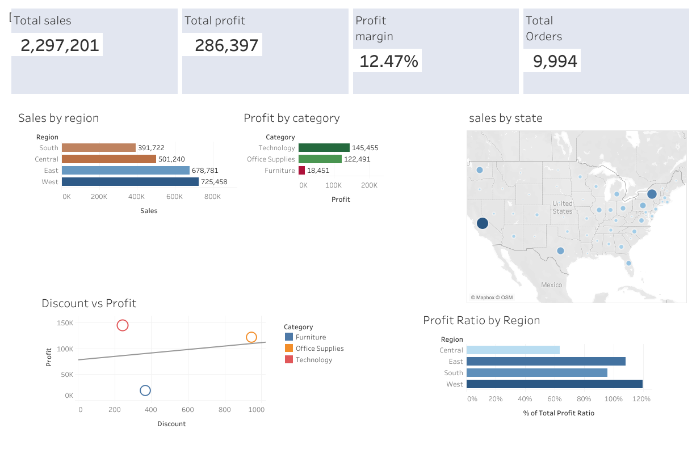

# Customer Experience & Profitability Dashboard (Tableau)

## 📊 Project Overview
This interactive Tableau dashboard analyzes revenue performance, profitability trends, and regional insights to support data-driven decision-making.

The dashboard highlights:
- Total Sales
- Total Profit
- Profit Margin
- Regional performance
- Category-level profitability
- Geographic sales distribution
- Discount impact analysis

---

## 🎯 Key Insights
- Identifies high-performing and underperforming regions.
- Highlights profit margin variations across categories.
- Evaluates the relationship between discounting and profitability.
- Provides executive-level KPIs for performance tracking.

---

## 🛠 Tools Used
- Tableau Public
- Data Visualization
- Calculated Fields
- Trend Analysis
- Interactive Filters

---

## 🔗 Live Interactive Dashboard
[View on Tableau Public](https://public.tableau.com/views/Book1_17722362227180/Dashboard2?:language=en-GB&publish=yes&:sid=&showOnboarding=true&:display_count=n&:origin=viz_share_link)

---

## 📷 Dashboard Preview

